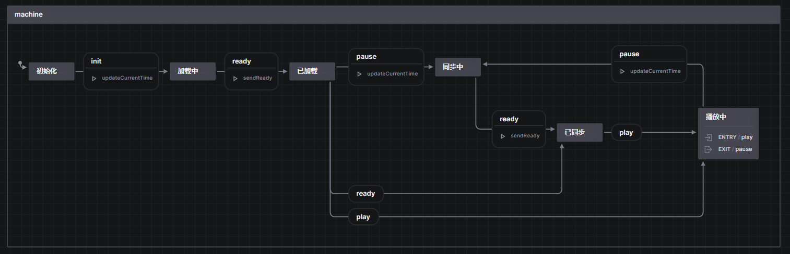

# 17放映室

## 框架

- 前端：Vue.js  + TypeScript + tailwind.css + xstate + vueuse + socketIO
- 后端：Express + TypeScript + socketIO + MongoDB

## 启动

``` powershell
cd express
npm i
npm run dev

cd vue
npm i
npm run dev
```

## 核心

### 1. 通信

使用 SocketIO 实现全双工通信

``` typescript
export interface ServerToClientEvents {
    // room
    'new': (num: number) => void;
    // video
    'init': (currentTime: number) => void;
    'ready': () => void;
    'play': () => void;
    'pause': (currentTime: number) => void;
    // chat
    'msg': (nickname: string, content: string) => void;
}

export interface ClientToServerEvents {
    'ready': () => void;
    'play': () => void;
    'pause': (currentTime: number) => void;
    'src': (src: string) => void;
    // chat
    'msg': (content: string) => void;
}
```

### 2. 状态机

使用 xstate 实现状态机

``` typescript
export enum State {
    INIT = '初始化',    // 初始状态
    LOADING = '加载中', // 载入视频并跳转到时间点
    LOADED = '已加载',  // 等待根据服务器端指令进入指定状态
    SYNCING = '同步中',
    SYNCED = '已同步',
    PLAYING = '播放中'
}
```

